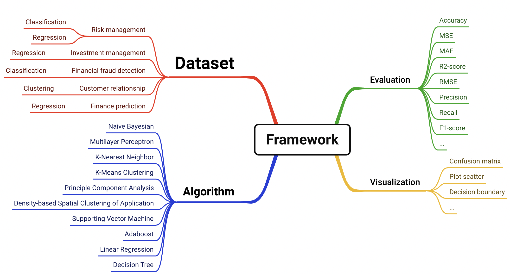

# Framework for ML in Finance

## 📚 Background
Machine learning needs in the **finance** field: Machine learning algorithms can be used in many aspects such as risk management, asset management, market analysis and trading strategies, and have become a key tool in the field of finance and trading.
### Goals and Significance
#### Goals
* Develop a custom Python machine learning framework
* Intergrate basic machine learning algorithms implemented through packages such as numpy
* Evaluate the algorithms in a variety of financial scenarios
#### Significance
* Develop a machine learning framework for the financial field to provide solutions more suitable for financial problems instead of just relying on general machine learning libraries
* A framework for machine learning beginners to quickly get started with basic machine learning algorithms

## 📈 Applications
| Problem | Solution | Algorithm |
| :----: | :----: | :----:|
| Risk Management | Classification, Regression | Principle Component Analysis(PCA), Adaboost|
| Financial Fraud Detection | Classification, Clustering | K-Nearest Neighbor(KNN), K-Means, DBSCAN |
| Customer Relationship Management | Classification | Naive Bayes, Adaboost |
| Financial Forecast | Regression | Support Vector Machine(SVM) |
| Investment and Asset Management | Regression | Linear Regression |

## 🎮 Other Machine learning Algorithms
- Multilayer Perceptron, used for classification / regression, can be applied to promotion, fraud detection and so on.
- Decision Tree, used for classification, can be applied to direct marketing, risk management and so on.
- ...

## 🎬 Demo
Here is a demo of using svm on the netflix stock dataset to do finance prediction.


### Main Content
✨Here is an overview of this framework.
<br>
<div align="center">

</div>
<br>

## Setup
- Install.
```bash
pip install -i requirements.txt
```

## Run
- Init weight.
Create a model config yaml file under `./config/`, which indicate the initial weight name and value of the model. Examples can be found in the existing config directory.
- Write the bash command under `./scripts/`. Examples can be found in the existing config directory.
```bash
bash scripts/run_svm.sh
```
During running, you need to enter natural language that describe how you would like to preprocess the data. After model training, you also need to enter the evaluation metric and the visualization method you would use.


## Main File Sturcture
```
├── main.py
├── pipeline.py
├── ...
├── /dataset/
│  ├── base.py
│  ├── risk_management.py
│  ├── investment_and_asset_management.py
│  ├── ...
│  └── finance_prediction.py
├── /algorithms/
│  ├── base.py
│  ├── svm.py
│  ├── linear_regression.py
│  ├── ...
│  └── pca.py
├── /evaluate/
│  └── utils.py
├── /visualization/
│  └── utils.py
```

## Results and Evaluation


## Future Work
* Develop interactive UI
* Intergrate More algorithms
* Encapsulate the data preprocessing process to reduce the cost of getting started
